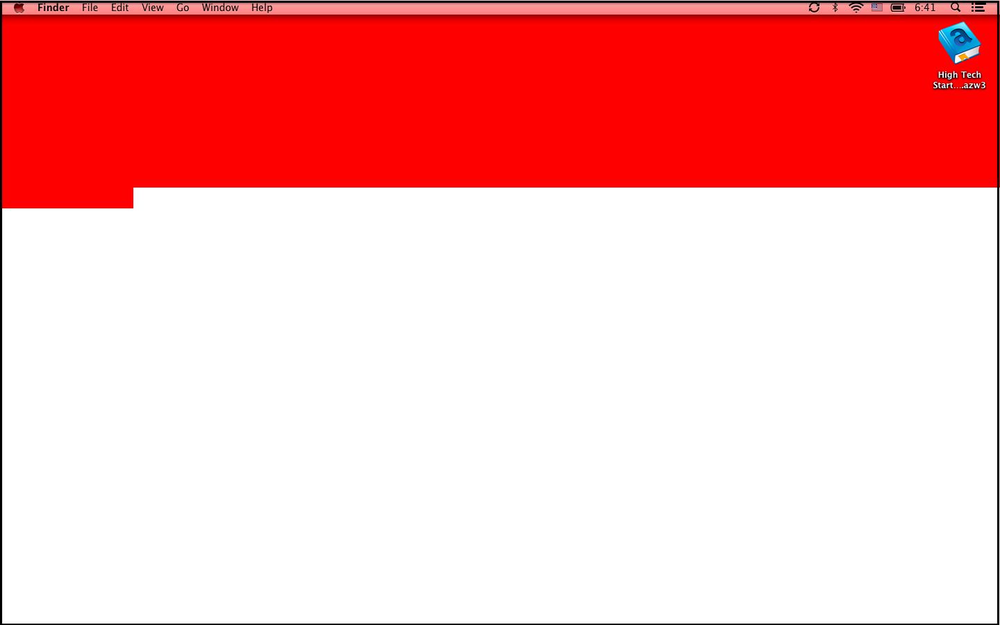

life-calendar
=============

a desktop background that marks your progress through life. A new block turns red every month. When all the blocks are red, it's game over.

Screenshot
==========

How to use
==========

OS X:

0. change the numbers in data.txt to be your current age in month and year. So 1 23 would be 23 years and 1 month.
1. run `crontab -e` and enter the following `0 0 1 * * /usr/bin/python path_to_cron.py`